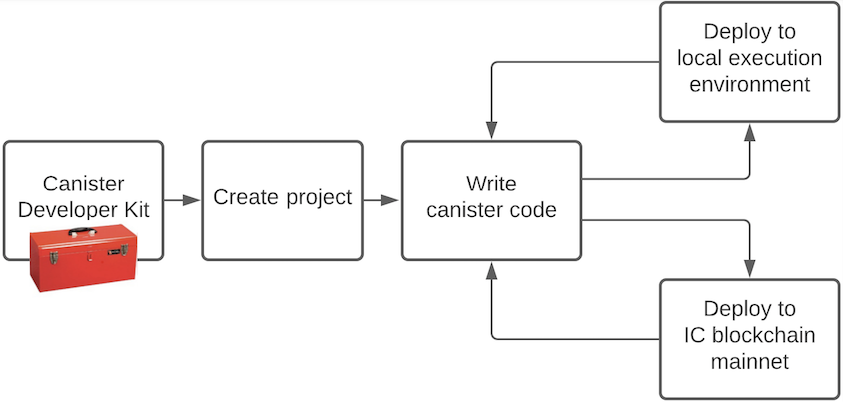

# Project Title
One paragraph of project description goes here. Things to include:
- What is the primary functionality of this project?
- What is the purpose of this project?
- How does it look like in action? Have any screenshots, videos etc.?
- Link to the live version/canister, if there is one

## Introduction
This is a high level description of the project. Describe what the project is for, what it is doing and which problem it solves. This should not be long, usually 2-3 lines is good, keep it short and precise.

Highlight some features:
- Consectetur adipiscing elit in efficitur.
- Congue ac nunc nec, bibendum hendrerit mi.
- Donec sodales ligula ac dolor vehicula, at venenatis nulla feugiat.

Adding an illustration of the architecture can quickly explain how the project is built, and how it works. 



## Installation
Step-by-step guide to get a copy of the project up and running locally for development and testing.

### Prerequisites
Which things you need to install the softwre and how to install them,

```bash
$ install required software and libraries
```

### Install
A step-by-step guide to installing the project, including necessary configuration etc.

```bash
$ git clone <GitHub repo>
$ cd <project>
$ npm install
$ dfx start --background
$ dfx deploy
```

Nullam eu dictum ipsum, eu sagittis lacus. Integer posuere purus vel nisi sodales posuere. Donec dolor libero, posuere ac lacinia vitae, ornare a nisl. Praesent placerat quam non elit blandit, ut pretium lacus rutrum.

## Usage
Most projects have a frontend, so link to the canister and provide a brief getting-started instruction. If the project has a backend that may be called without a frontend, which is typically the case for developer libraries, tooling, infrastructure etc., then provide some basic examples of how to use it. 

### Example 1
Usage examples can be canister calls:

```bash
$ dfx canister call mycanister myfunc '("abc")'
```

### Example 2
If the project is added as a separate canister, show how to access the functions.

```javascript
import MyFunc  "mo:myproj/MyFunc";  

private let myFunc = MyFunc.MyFunc();

...

let value = myFunc("abc");

...
```

## Documentation
Further documentation can exist in the README file if the project only contains a few functions. It can also be located elsewhere, if it is extensive, if this is the case, link to it.  

## Testing
Test instructions, and test scripts, for this project:

```bash
$ run test
```

Test specific feature:

```bash
$ run test 1
```

## Roadmap
Describe the project roadmap, this could be the grant milestones, but it could also be the team's broader project roadmap.

- [x] Lorem ipsum dolor sit amet, consectetur adipiscing elit.
- [x] Praesent semper quis libero eu fermentum. 
- [x] Morbi sed velit scelerisque, semper ante vel, tincidunt velit. 
- [x] Sed posuere feugiat nisi, et porttitor ante volutpat ac.
- [ ] Praesent vehicula ultrices vehicula. Suspendisse arcu dui, egestas ac lacus non, efficitur lacinia purus.
- [ ] Curabitur ornare vehicula feugiat.

## License
This project is licensed under the MIT license, see LICENSE.md for details. See CONTRIBUTE.md for details about how to contribute to this project. 

## Acknowledgements
- Hat tip to anyone who's code was used
- External contributors
- Etc.

## References
- [Internet Computer](https://internetcomputer.org)
- Etiam dolor ante
- Nullam iaculis risus vitae


